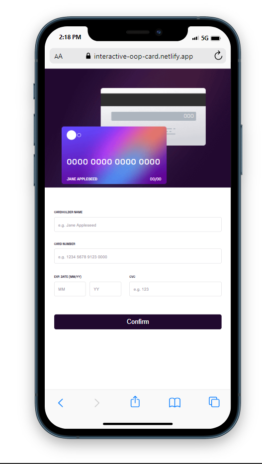

# Frontend Mentor - Interactive card details form solution

This is a solution to the [Interactive card details form challenge on Frontend Mentor](https://www.frontendmentor.io/challenges/interactive-card-details-form-XpS8cKZDWw). Frontend Mentor challenges help you improve your coding skills by building realistic projects.

## Table of contents

- [Overview](#overview)
  - [The challenge](#the-challenge)
  - [Screenshot](#screenshot)
  - [Links](#links)
- [My process](#my-process)
  - [Built with](#built-with)
  - [What I learned](#what-i-learned)
  - [Continued development](#continued-development)
  - [Useful resources](#useful-resources)
- [Author](#author)
- [Acknowledgments](#acknowledgments)

**Note: Delete this note and update the table of contents based on what sections you keep.**

## Overview

### The challenge

Users should be able to:

- Fill in the form and see the card details update in real-time
- Receive error messages when the form is submitted if:
  - Any input field is empty
  - The card number, expiry date, or CVC fields are in the wrong format
- View the optimal layout depending on their device's screen size
- See hover, active, and focus states for interactive elements on the page

### Screenshot




### Links

- Solution URL: [Solution URL here](https://github.com/Lansa-18/Interactive-card-OOP)
- Live Site URL: [Live Site URL here](https://interactive-oop-card.netlify.app/)

## My process

### Built with

- Semantic HTML5 markup
- CSS custom properties
- SCSS
- Flexbox
- OOP JavaScript

### What I learned

I delved deeper into writing JavaScript code using an Object-Oriented Programming (OOP) approach. Although challenging, I gained a fundamental understanding of how to structure code in an OOP style. As I apply this knowledge to more projects in the future, I anticipate a deeper and more intuitive grasp of Object-Oriented Programming principles.

This was by far, one of the most challenging logic to come up with in this project. This is the method that gets called when the user submits the form. Of course it's a lot deeper than it looks.

```js
  _form(e) {
    e.preventDefault();
    allErrorSpan.forEach(err => err.classList.add('hidden'));

    let isValid = true;
    let errorIndices = [];

    if (!this._validateName()) {
      isValid = false;
      errorIndices.push(0);
    }

    if (!this._validateNumber()) {
      isValid = false;
      errorIndices.push(1);
    }

    if (!this._validateMonth(inputCardMonth.value)) {
      isValid = false;
      errorIndices.push(2);
    }

    if (!this._validateYear(inputCardYear.value)) {
      isValid = false;
      errorIndices.push(3);
    }

    if (!this._validateCvc(inputCardCvc.value)) {
      isValid = false;
      errorIndices.push(4);
    }

    if (isValid) {
      this._updateCard();
      this._showthankYou();
      this._removeErrorMessage(errorIndices);
    } else {
      this._allErrorMessage(errorIndices);
    }
  }
```

### Continued development

I'll be focusing more on improving my OOP logic writing as well as my overall JavaScript proficiency.

## Author

- Frontend Mentor - [@GentleMizt](https://www.frontendmentor.io/profile/GentleMizt)
- Twitter - [@Lansa_18](https://twitter.com/Lansa_18)

## Acknowledgments

Special thanks to [ANONYMOUS](https://twitter.com/_Annonnymouss_) for his guidance and expertise. He really helped me spot out tons of bugs.
